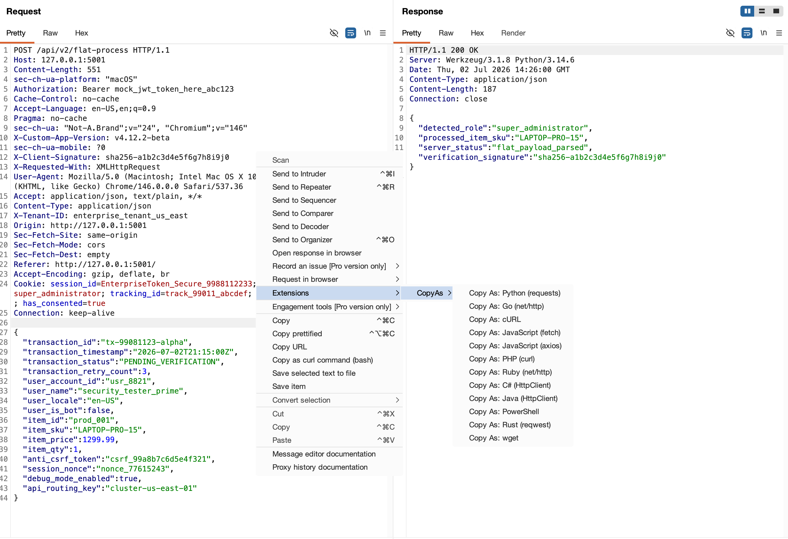

# CopyAs - Burp Suite Extension

Right-click any HTTP request in Burp Suite and instantly copy it as ready-to-run code. No more manually rewriting requests.



## Supported Formats

| Format | Language | Library |
|--------|----------|---------|
| Python | Python 3 | `requests` |
| Go | Go | `net/http` |
| cURL | Shell | `curl` |
| JavaScript (fetch) | JavaScript | `fetch` API |
| JavaScript (axios) | JavaScript / Node.js | `axios` |
| PHP | PHP | `curl_*` functions |
| Ruby | Ruby | `net/http` |
| C# | C# / .NET | `HttpClient` |
| Java | Java 11+ | `java.net.http.HttpClient` |
| PowerShell | PowerShell | `Invoke-RestMethod` |
| Rust | Rust | `reqwest` |
| wget | Shell | `wget` |

## Features

- **Copy As** submenu in right-click context menu
- 12 output formats covering major languages and tools
- Works in Proxy, Repeater, Target, Intruder, and Logger
- Preserves headers, cookies, body, and content type
- JSON body detection with proper serialization per language
- Standalone CLI converter with `--format` flag
- Supports Burp Suite 2020+ (Legacy API)

## Installation

1. In Burp Suite -> **Extensions** -> **Installed** -> **Add**
2. Set Extension type to **Python**
3. Select `copy_as.py`
4. Done!

## Usage

### Burp Suite Extension

1. Send any request to Proxy/Repeater/Target
2. Right-click the request
3. Select **Copy As** -> choose your language
4. Code is copied to clipboard

### Standalone CLI Converter

```bash
# Pipe a raw HTTP request
echo 'GET / HTTP/1.1\r\nHost: example.com' | python converter.py --format curl

# From a file
python converter.py --file request.txt --format go

# Simple URL to GET request
python converter.py --url https://example.com --format python

# Output all formats at once
python converter.py --file request.txt --format all
```

## Output Examples

Given this request:

```http
POST /api/login HTTP/1.1
Host: example.com
Content-Type: application/json
Cookie: session=abc123

{"username": "admin", "password": "test123"}
```

### Python (requests)

<details>
<summary>View code</summary>

```python
import requests

url = "https://example.com/api/login"

headers = {
    "Content-Type": "application/json",
}

cookies = {
    "session": "abc123",
}

json_body = {
    "username": "admin",
    "password": "test123"
}

response = requests.post(url, headers=headers, cookies=cookies, json=json_body)

print(response.status_code)
print(response.text)
```

</details>

### Go (net/http)

<details>
<summary>View code</summary>

```go
package main

import (
	"fmt"
	"io"
	"net/http"
	"strings"
)

func main() {
	body := strings.NewReader(`{"username": "admin", "password": "test123"}`)
	req, _ := http.NewRequest("POST", "https://example.com/api/login", body)
	req.Header.Set("Content-Type", "application/json")
	req.AddCookie(&http.Cookie{Name: "session", Value: "abc123"})

	resp, _ := http.DefaultClient.Do(req)
	defer resp.Body.Close()

	data, _ := io.ReadAll(resp.Body)
	fmt.Println(resp.StatusCode)
	fmt.Println(string(data))
}
```

</details>

### cURL

<details>
<summary>View code</summary>

```bash
curl -s -X POST "https://example.com/api/login" \
  -H "Content-Type: application/json" \
  -H "Cookie: session=abc123" \
  --data-raw '{"username": "admin", "password": "test123"}'
```

</details>

### JavaScript (fetch)

<details>
<summary>View code</summary>

```javascript
const response = await fetch("https://example.com/api/login", {
  method: "POST",
  headers: {
    "Content-Type": "application/json",
  },
  body: JSON.stringify({"username": "admin", "password": "test123"}),
});

console.log(response.status);
console.log(await response.text());
```

</details>

### JavaScript (axios)

<details>
<summary>View code</summary>

```javascript
const axios = require("axios");

const response = await axios({
  method: "POST".toLowerCase(),
  url: "https://example.com/api/login",
  headers: {
    "Content-Type": "application/json",
  },
  data: {"username": "admin", "password": "test123"},
});

console.log(response.status);
console.log(response.data);
```

</details>

### PHP (curl)

<details>
<summary>View code</summary>

```php
<?php

$ch = curl_init();
curl_setopt($ch, CURLOPT_URL, "https://example.com/api/login");
curl_setopt($ch, CURLOPT_CUSTOMREQUEST, "POST");
curl_setopt($ch, CURLOPT_RETURNTRANSFER, true);
$headers = [
    "Content-Type: application/json",
];
curl_setopt($ch, CURLOPT_HTTPHEADER, $headers);
curl_setopt($ch, CURLOPT_COOKIE, "session=abc123");
curl_setopt($ch, CURLOPT_POSTFIELDS, '{"username": "admin", "password": "test123"}');
$response = curl_exec($ch);
$statusCode = curl_getinfo($ch, CURLINFO_HTTP_CODE);
curl_close($ch);

echo $statusCode . "\n";
echo $response . "\n";
?>
```

</details>

### Ruby (net/http)

<details>
<summary>View code</summary>

```ruby
require "net/http"
require "uri"
require "json"

uri = URI.parse("https://example.com/api/login")

request = Net::HTTP::Post.new(uri)
request["Content-Type"] = "application/json"
request["Cookie"] = "session=abc123"
request.body = {"username" => "admin", "password" => "test123"}.to_json

response = Net::HTTP.start(uri.hostname, uri.port, :use_ssl => uri.scheme == "https") do |http|
  http.request(request)
end

puts response.code
puts response.body
```

</details>

### C# (HttpClient)

<details>
<summary>View code</summary>

```csharp
using System;
using System.Net.Http;
using System.Text;
using System.Threading.Tasks;

class Program
{
    static async Task Main()
    {
        using var client = new HttpClient();
        client.DefaultRequestHeaders.Add("Content-Type", "application/json");
        client.DefaultRequestHeaders.Add("Cookie", "session=abc123");

        var json = @"{""username"": ""admin"", ""password"": ""test123""}";
        var content = new StringContent(json, Encoding.UTF8, "application/json");

        var response = await client.PostAsync("https://example.com/api/login", content);
        var responseBody = await response.Content.ReadAsStringAsync();

        Console.WriteLine(response.StatusCode);
        Console.WriteLine(responseBody);
    }
}
```

</details>

### Java (HttpClient)

<details>
<summary>View code</summary>

```java
import java.net.URI;
import java.net.http.HttpClient;
import java.net.http.HttpRequest;
import java.net.http.HttpResponse;

public class Main {
    public static void main(String[] args) throws Exception {
        HttpClient client = HttpClient.newHttpClient();

        HttpRequest request = HttpRequest.newBuilder()
                .uri(URI.create("https://example.com/api/login"))
                .header("Content-Type", "application/json")
                .header("Cookie", "session=abc123")
                .POST(HttpRequest.BodyPublishers.ofString("""
                    {"username": "admin", "password": "test123"}
                """))
                .build();

        HttpResponse<String> response = client.send(request, HttpResponse.BodyHandlers.ofString());

        System.out.println(response.statusCode());
        System.out.println(response.body());
    }
}
```

</details>

### PowerShell

<details>
<summary>View code</summary>

```powershell
$headers = @{
    "Content-Type" = "application/json"
}

$body = @'
{"username": "admin", "password": "test123"}
'@

$response = Invoke-RestMethod `
    -Method POST `
    -Uri "https://example.com/api/login" `
    -Headers $headers `
    -Body $body

Write-Output $response
```

</details>

### Rust (reqwest)

<details>
<summary>View code</summary>

```rust
use std::collections::HashMap;

#[tokio::main]
async fn main() -> Result<(), Box<dyn std::error::Error>> {
    let client = reqwest::Client::new();

    let mut request = client.post("https://example.com/api/login");
    request = request.header("Content-Type", "application/json");
    request = request.header("Cookie", "session=abc123");
    request = request.json(&serde_json::json!({"username": "admin", "password": "test123"}));

    let response = request.send().await?;
    let status = response.status();
    let body = response.text().await?;

    println!("{}", status);
    println!("{}", body);

    Ok(())
}
```

</details>

### wget

<details>
<summary>View code</summary>

```bash
wget -q -O - \
  --header="Content-Type: application/json" \
  --header="Cookie: session=abc123" \
  --body-data='{"username": "admin", "password": "test123"}' \
  "https://example.com/api/login"
```

</details>

## Files

| File | Description |
|------|-------------|
| `copy_as.py` | Burp Suite extension (Jython) |
| `converter.py` | Standalone CLI converter (Python 3) |

## Requirements

- **Burp Suite Extension**: Burp Suite 2020+ with Jython standalone JAR configured
- **CLI Converter**: Python 3.6+ (no external dependencies)

## Contributing

Contributions are welcome! Here's how you can help:

- **Add a new format** — Fork, add your converter method + escape helper, update the menu entries, and open a PR.
- **Report a bug** — Open an issue with the raw HTTP request that broke (redact sensitive data).
- **Improve existing output** — If a generated snippet isn't idiomatic, PRs are appreciated.

### Adding a New Format

1. Add a `_yourformat(self, inv)` method in `MenuFactory`
2. Add the menu entry in `createMenuItems`
3. Add any escape helpers you need (e.g. `_esc_yourformat`)
4. Test it in Burp Suite by right-clicking any request

## License

MIT
